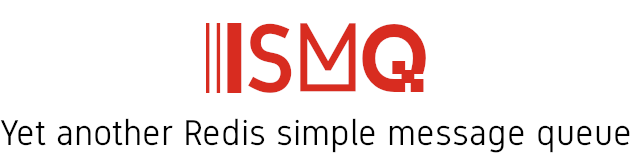

<div align="center" style="text-align: center">
  <p><a href="https://github.com/weyoss/redis-smq-monitor"></a></p>
  <p>A simple high-performance Redis message queue for Node.js.</p>
</div>

# RedisSMQ Monitor

<p>
    <a href="https://github.com/weyoss/redis-smq-monitor/actions/workflows/tests.yml"></a>
    <a href="https://npmjs.org/package/redis-smq-monitor" rel="nofollow"></a>
    <a href="https://codecov.io/github/weyoss/redis-smq-monitor?branch=master" rel="nofollow"></a>
    <a href="https://lgtm.com/projects/g/weyoss/redis-smq-monitor/context:javascript" rel="nofollow"></a>
</p>

RedisSMQ Monitor is an application which lets you monitor, debug, and manage [RedisSMQ message queue](https://github.com/weyoss/redis-smq).

The monitor uses and ships with [RedisSMQ Monitor Client](https://github.com/weyoss/redis-smq-monitor-client) as a default Web UI client.

[An HTTP API](/docs/http-api.md) is also provided. The `HTTP API` interface enables you to manage the message queue from your application using the HTTP protocol.

## Installation

```shell
npm install redis-smq-common redis-smq redis-smq-monitor --save
```

Considerations:

- Minimal Node.js version is >= 14 (RedisSMQ Monitor is tested under current active LTS and maintenance LTS Node.js releases).
- Minimal Redis server version is 2.6.12 (RedisSMQ Monitor is tested under Redis v2.6, v3, v4, v5, and v6).

## Configuration

```javascript
'use strict';

module.exports = {
  redis: {
    client: 'redis',
    options: {
      host: '127.0.0.1',
      port: 6379,
      connect_timeout: 3600000,
    },
  },
  logger: {
    enabled: true,
    options: {
      level: 'info',
      /*
      streams: [
          {
              path: path.normalize(`${__dirname}/../logs/redis-smq-monitor.log`)
          },
      ],
      */
    },
  },
  server: {
    host: '127.0.0.1',
    port: 3000,
    socketOpts: {
      // ...
    }
  }
};
```

**Parameters**

- `redis` *(object): Optional.* See [Redis Configuration](https://github.com/weyoss/redis-smq-common/blob/master/docs/redis.md) for more details.

- `logger` *(object): Optional.* See [Logs Configuration](https://github.com/weyoss/redis-smq-common/blob/master/docs/logs.md) for more details.

- `server`*(object): Optional.*

- `server.host` *(String): Optional.* IP address of the monitor server. By default, `0.0.0.0`.

- `server.port` *(Integer): Optional.* Port of the monitor server. By default, `7210`.

- `server.basePath` *(String): Optional.* Let the monitor know that it is running behind a reverse proxy server and use a base path (for example `/monitor`) to render links and redirects correctly. See [Running the RedisSMQ Monitor behind a reverse proxy](#running-redissmq-monitor-behind-a-reverse-proxy).

- `server.socketOpts` *(Object): Optional.* WebSocket parameters for `socket.io`. See [https://socket.io/docs/v4/server-api/#new-serverport-options](https://socket.io/docs/v4/server-api/#new-serverport-options) for more details.

## Usage

Before launching the monitor server, you should first configure RedisSMQ to use the monitor event listeners. 

RedisSMQ Monitor comes with a couple of event listeners that you need to register within RedisSMQ for having such features as:

- Real-time message rates:
  - Overall acknowledged/dead-lettered/published message rates
  - Acknowledged/dead-lettered/published message rates per queue
  - Acknowledged/dead-lettered/published message rates per queue/consumer
- Historical time series graphs of message rate with the ability to navigate through the timeline

### Monitor Event Listeners

The monitor provides:

- `ConsumerEventListener` for handling consumers message rates.
- `ProducerEventListener` for handling producers message rates.

```javascript
const { ConsumerEventListener, ProducerEventListener } = require('redis-smq-monitor');

const config = {
  eventListeners: {
    consumerEventListeners: [ConsumerEventListener],
    producerEventListeners: [ProducerEventListener],
  },
}
```

See [RedisSMQ/Configuration](https://github.com/weyoss/redis-smq/blob/master/docs/configuration.md) for more details.
See [RedisSMQ/Event Listeners](https://github.com/weyoss/redis-smq/blob/master/docs/event-listeners.md) for more details.

### Launching the monitor application

Once your consumers/producers are now using the plugins, the monitor can be launched from any other process or host 
(as well as the host can access the Redis server) and used as shown in the example bellow:

```javascript
'use strict';
const config = require('./config');
const { MonitorServer } = require('redis-smq-monitor');

const monitorServer = MonitorServer.createInstance(config);
monitorServer.listen();
```

### Running RedisSMQ Monitor behind a reverse proxy

To run the monitor behind a reverse proxy server you need first to configure correctly your server.

Depending on your setup, some extra steps may be required. The easiest way to start with is to serve the monitor using a transparent proxy.

I am using Nginx as a proxy server, but you can use any other server depending on your preferences.

#### Transparent reverse proxy

Sample Nginx configuration:

```text
map $http_upgrade $connection_upgrade {
    default upgrade;
    '' close;
}
upstream redis-smq {
    server 127.0.0.1:3000;
}
server {
    listen       5000;
    listen  [::]:5000;
    location / {
        proxy_pass http://redis-smq;
        proxy_http_version 1.1;
        proxy_set_header Upgrade $http_upgrade;
        proxy_set_header Connection $connection_upgrade;
    }
}
```

No additional configuration is required.

#### Reverse proxy with URL rewrite

Sample Nginx configuration:

```text
map $http_upgrade $connection_upgrade {
    default upgrade;
    '' close;
}
upstream redis-smq {
    server 127.0.0.1:3000;
}
server {
    listen       5000;
    listen  [::]:5000;
    location /monitor {
        proxy_pass http://redis-smq;
        proxy_http_version 1.1;
        proxy_set_header Upgrade $http_upgrade;
        proxy_set_header Connection $connection_upgrade;
        rewrite  ^/monitor/(.*)  /$1 break;
    }
}
```

Additionally, you need to configure the basePath.

Sample configuration:

```javascript
'use strict';

module.exports = {
  server: {
    host: '127.0.0.1',
    port: 3000,
    basePath: '/monitor' // <-- using the base path
  }
};
```

## License

[MIT](https://github.com/weyoss/redis-smq-monitor/blob/master/LICENSE)